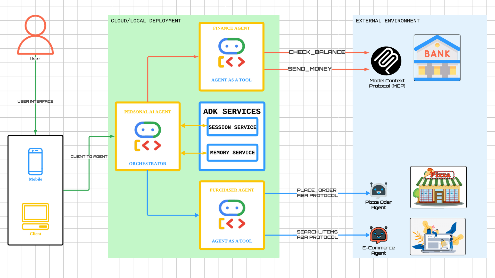

# Personal AI Agent Orchestrator - Capstone Project

This project demonstrates a sophisticated multi-agent system designed to act as a personal concierge, capable of managing finances and making purchases through a unified interface. Built as part of the **Kaggle 5-Day AI Agents Intensive**, this system leverages the Agent Development Kit (ADK), Model Context Protocol (MCP), and Agent-to-Agent (A2A) communication patterns.

## System Architecture

The following diagram illustrates the high-level workflow and interaction between the various agents in the system:



```mermaid
graph TD
    User[User] -->|Interacts with| RootAgent[Personal AI Agent (Root)]
    
    subgraph "Personal Agent Runtime"
        RootAgent -->|Stores/Retrieves| SessionService[Session Service]
        RootAgent -->|Stores/Retrieves| MemoryService[Memory Service]
        
        RootAgent -->|Delegates to| FinanceAgent[Finance Agent]
        RootAgent -->|Delegates to| PurchaserAgent[Purchaser Agent]
    end
    
    subgraph "External Services"
        FinanceAgent -->|MCP Protocol| BankMCP[Bank MCP Server]
        PurchaserAgent -->|A2A Protocol| PizzaAgent[Pizza Shop Agent]
        PurchaserAgent -->|A2A Protocol| EcommerceAgent[E-Commerce Agent]
    end

    style RootAgent fill:#f9f,stroke:#333,stroke-width:2px
    style MemoryService fill:#ff9,stroke:#333,stroke-width:2px
    style SessionService fill:#ff9,stroke:#333,stroke-width:2px
```

## Workflow Description

The system is composed of a central orchestrator and specialized sub-agents, each handling specific domains of responsibility.

### 1. User Interface (Client)
- **Entry Point**: The user interacts with the system through a mobile or web client interface.
- **Client-to-Agent**: Requests are sent securely to the **Personal AI Agent** hosted on Google Cloud.

### 2. Personal AI Agent (Orchestrator)
- **Role**: Acts as the central brain of the system. It parses user intent and delegates tasks to the appropriate specialized agents.
- **Memory**: Equipped with **Memory Service** to store and recall user preferences and past interactions across sessions.
- **Routing**: Depending on the request (e.g., "Check my balance" or "Order a pizza"), it routes instructions to either the Finance Agent or the Purchaser Agent.

### 3. Finance Agent (Agent as a Tool)
- **Role**: Manages all financial transactions and inquiries.
- **Capabilities**:
  - **Check Balance**: Retrieves current account status.
  - **Send Money**: Initiates transfers between accounts.
- **Integration**: Uses the **Model Context Protocol (MCP)** to securely communicate with the **Bank** system.

### 4. Purchaser Agent (Agent as a Tool)
- **Role**: Handles all procurement and shopping tasks.
- **Delegation**: It further delegates specific requests to domain-specific external agents using the **A2A (Agent-to-Agent) Protocol**.
  - **Pizza Order Agent**: For food delivery requests (e.g., `PLACE_ORDER`).
  - **E-Commerce Agent**: For general shopping and product searches (e.g., `SEARCH_ITEMS`).

## Memory & Persistence

The Personal AI Agent is enhanced with memory capabilities to provide a more personalized experience.

-   **Memory Service**: Utilizes `InMemoryMemoryService` to store user preferences and important information across different conversation sessions.
-   **Session Service**: Uses `InMemorySessionService` to manage active conversation contexts.
-   **Automatic Saving**: An `after_agent_callback` (`auto_save_to_memory`) is implemented to automatically persist the session state to memory after every agent turn.
-   **Retrieval**: The agent is equipped with the `load_memory` tool, allowing it to proactively search for and recall past interactions when needed (e.g., remembering a user's favorite color or past orders).

*Note: The current implementation uses in-memory storage, which is volatile and resets when the application restarts.*

## Key Technologies
- **Google Cloud**: Hosts the primary agent infrastructure.
- **Agent Development Kit (ADK)**: Framework for building the agents.
- **Model Context Protocol (MCP)**: Standardized protocol for connecting AI models to external data and tools (used for the Bank connection).
- **A2A Protocol**: Enables interoperability and communication between independent agents (used for Pizza and E-Commerce services).

## Project Track
**Concierge Agents**: This project fits the Concierge track by improving personal productivity through automated financial management and purchasing.
